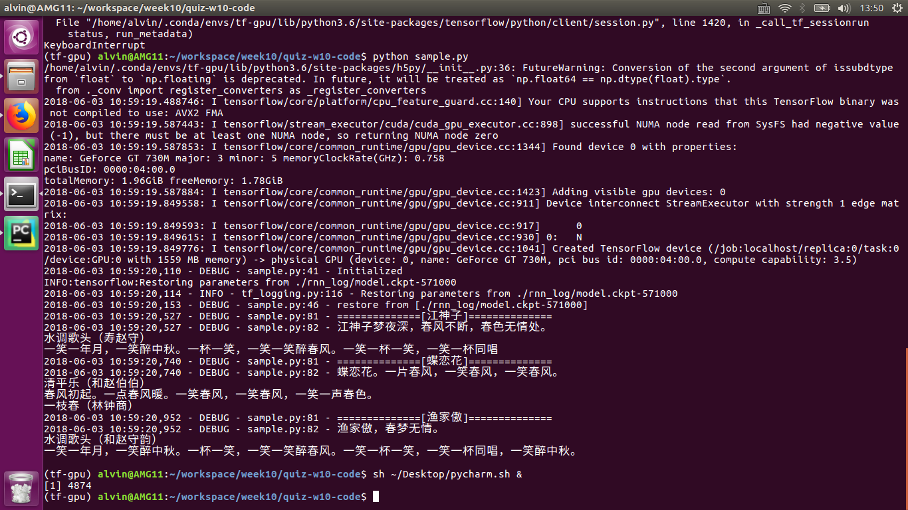

# 作业结果说明：
1. 作业最终运行结果请参考 
2. dictionary.json和reverse_dictionary.json是在Word Embedding阶段生成的。在对原文件进行处理的时候，把所有重复的换行符"\n"都进行了去重操作，以去除多余的空行。

# 对RNN训练的理解：
1. 数据预处理阶段： 
-- 直接对文档中单个的字进行分词，操作方式简单粗暴...可以适当的添加一些分词的操作，并对vocabulary size进行调整，查看对最终结果的影响。

2. 训练阶段：
-- 对batch_size和window_size的理解还是很重要的，还需要继续加深。
-- 由于古文的长度相对还是比较短的，所以window_size这里还需要进行适当的调整。

3. 最终结果：
最终结果不是很理想，虽然也有输出，但是语义上还是不通顺。而且三个词的内容重复较多，说明模型还不能根据词名输出更具针对性的结果。
